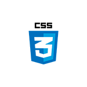
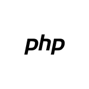
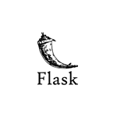
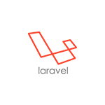
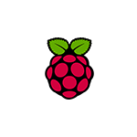
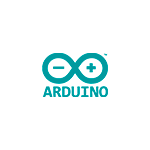

Hi, I'm Domm! I'm freelance Full Stack Developer from Italy developing web-apps and other web-based projects.
I am embracing open source.

Currently working on [arkastech](https://arkastech.it/) and [dplace](https://dplace.biz)

### 🧰 My favorite tools:

    
    
    
    
    
    
    
    

### 🛠 Other tools that I like:

    
    
    
    
    
    
    
    
    

### 🤖 HW tools that I love:

    
    

### 🌍 Find me on the web:
- You can find my full portfolio (Italian) on [Arkastech](https://arkastech.it/portfolio/)
- You can find me on [Twitter](https://twitter.com/domm_it)